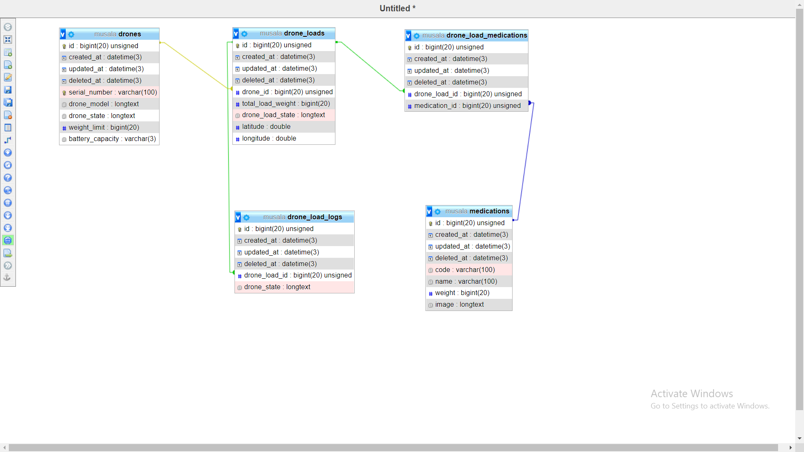

This solution based on my basic MVC file structure [Sakara](https://github.com/AmrAhmedFekry/Sakara).


# System Design  



As Shown in diagram we have collapse the medications items in drone_load that gave us the ability to track the load, and make logs for it.


# API DOCS


# Setting API DOCS

# Base URL
http://localhost:8080/api

# Other resources 

 
# Headers

Locale: ar|en 

Accept : application/json

# API 

| Route                           | Request Method | Parameters                                           | Response  |
| -----------                     | -----------    |-----------                                           |---------- |
|/drone/register                  | POST           |  [Register Drone Parameters](#RegisterDroneRequest)        |[Response](#Response)|
|/medication                      |POST            |  [Register Medication Parameters](#RegisterMedication)          |[Response](#Response) |
|/load                        | POST           |  [Load Parameters](#RegisterMedicationRequest)       |[Response](#Response)|
|/upload                      | POST           |  [Upload Parameters](#UploadMediaRequest)            |[Response](#UploadResponse)|
|/available/loading/drones       | GET            | [-]                                                  |[Response](#AvailableResponse)|
|/drone/battery_level/{droneId}  | GET            | [-]                                                 ||[Response](#showBatteryResponse)|
|/change_drone_load_state        | PUT            |[Change State](#ChangeDroneLoadRequest)         |  |[Response](#ChangeDroneLoadResponse)|

# <a name="UploadMediaRequest"> </a> Upload Media Request

```json
{
    "image" : "File",
} 
```


# <a name="UploadResponse"> </a> Upload Media Response

```json
{
    "fileName": "string",
    "filePath": "String",
    "message": "Your file has been successfully uploaded."
} 
```


# <a name="RegisterDroneRequest"> </a> Register new Drone 

```json
{
    "serial_number" : "String",
    "model" : "String",
    "weight_limit" : "int"
} 
```

# <a name="LoadDroneRequest"> </a> Load Drone with medications 

```json
{
    "drone_id" : "Int",
    "medication_items" : "ArrayOfIds",
    "latitude" : "int", 
    "longitude" : "int"
}
```


# <a name="RegisterMedicationRequest"> </a> Register new Medication

```json
{
    "code" : "String",
    "name" : "String",
    "weight" : "int", 
    "image" : "String"
    } 
```

`Note` You can Use the upload API, to upload medication image and use the returned fileName from response as image param.


# <a name="Response"> </a> Responses 

## Validation error 
__*Response code : 401*__

```json 
{
    "code": 401,
    "errors": [],
    "message": "Validation Error",
    "payload": null
}
```
## Success  
__*Response code : 201*__
```json 
{
    "code": 200,
    "errors": null,
    "message": "Success",
    "payload": [
        {
        }
    ]
}
```

`Note` status code will 201 if the Request is POST


# <a name="AvailableResponse"> </a> Available Drones for loading Response 

```json
{
    "code": 200,
    "errors": null,
    "message": "Success",
    "payload": [
        {
            "BatteryCapacity": "Int",
            "DroneModel": "String",
            "DroneState": "String",
            "SerialNumber": "String",
            "WeightLimit": "int",
            "id": "Int"
        }
    ]
}} 
```


# <a name="showBatteryResponse"> </a> Show Battery level Response 

```json
{
    "code": 200,
    "errors": null,
    "message": "Success",
    "payload": 100
}}}
```

# <a name="ChangeDroneLoadRequest"> </a> Change Drone Load Request 

```json
{
    "drone_load_id" : 24,
    "drone_load_state" : "LOADED"
}}} 

```
# <a name="ChangeDroneLoadResponse"> </a> Change Drone Load Response 

```json
{
    "code": 200,
    "errors": null,
    "message": "Success",
    "payload": "Drone Load State Changed"
}}} 

